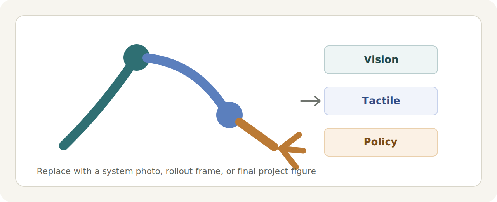
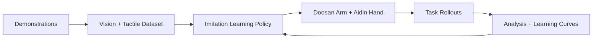
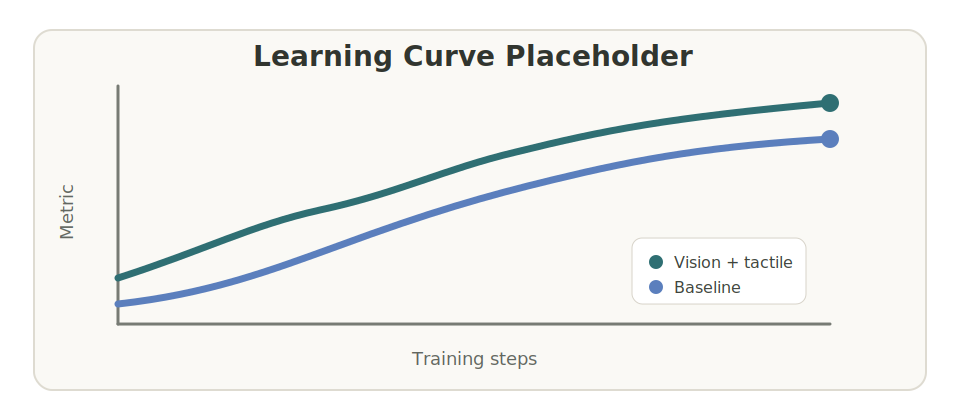

<div align="center">

# Aidin-Doosan Dexterous Manipulation

**Public thesis progress log for vision-tactile imitation learning with a Doosan arm and Aidin dexterous hand**

[](#project-overview)
[](#progress-snapshot)
[](#media-gallery)
[](#what-is-not-included)

</div>

<p align="center">
  
</p>

<p align="center">
  <em>Teaser placeholder: replace this with a system photo, task rollout, or concise pipeline figure.</em>
</p>

## Overview

This repository is a public-facing record of thesis progress on dexterous robotic manipulation using an Aidin hand mounted on a Doosan robot arm. The work studies how visual observations, tactile feedback, and imitation learning can be combined for contact-rich manipulation tasks.

The private development repository contains the implementation, datasets, and experiment scripts. This public repository is intentionally limited to high-level progress summaries, selected media, learning curves, and presentation-ready notes.

## Project Overview

The current research direction focuses on collecting demonstrations, training imitation learning policies, and evaluating whether tactile sensing improves robustness during grasping and placing.



## What This Repository Contains

- Public progress updates suitable for sharing with collaborators, advisors, and visitors.
- Selected figures, videos, and learning curves.
- High-level descriptions of experiments and milestones.
- Presentation-friendly summaries of what was tested and what changed.

## What Is Not Included

- Source code from the private research repository.
- Private studying notes, implementation notes, or debugging logs.
- Raw datasets, robot calibration files, trained checkpoints, or credentials.
- Any material that should stay internal to thesis development.

## Progress Snapshot

| Area | Current Public Status | Media |
| --- | --- | --- |
| Simulation environment | Placeholder for public summary | Add screenshot |
| Scripted demonstration collection | Placeholder for demo collection notes | Add rollout video |
| ACT-style imitation learning | Placeholder for training progress | Add learning curve |
| Tactile feedback experiments | Placeholder for tactile comparison | Add figure |
| Real robot integration | Placeholder for hardware status | Add system photo |

## Media Gallery

Add curated photos, figures, and videos here as the project develops.

| Preview | Description | Link |
| --- | --- | --- |
| `assets/images/system_overview.png` | Robot setup or simulation overview | Coming soon |
| `assets/videos/scripted_demo.mp4` | Scripted demonstration rollout | Coming soon |
| `assets/figures/training_curve.png` | Training or validation curve | Coming soon |
| `assets/videos/policy_rollout.mp4` | Learned policy rollout | Coming soon |

## Learning Curves

Use this section for clean, public plots only. Good candidates include loss curves, success-rate summaries, or tactile-vs-non-tactile comparisons.

<p align="center">
  
</p>

<p align="center">
  <em>Learning curve placeholder: replace with an exported plot when ready.</em>
</p>

## Experiment Timeline

| Date | Milestone | Public Notes |
| --- | --- | --- |
| YYYY-MM-DD | Repository created | Public progress page scaffolded |
| YYYY-MM-DD | Add first demo media | Placeholder |
| YYYY-MM-DD | Add first training curve | Placeholder |
| YYYY-MM-DD | Add tactile comparison | Placeholder |

## Repository Layout

```text
.
├── README.md
├── assets
│   ├── figures
│   ├── images
│   └── videos
└── docs
    ├── media_checklist.md
    └── progress_log.md
```

## Citation

If this project becomes part of a publication or thesis release, citation information will be added here.

```bibtex
@misc{aidin_doosan_thesis_progress,
  title  = {Aidin-Doosan Dexterous Manipulation Thesis Progress},
  author = {Your Name},
  year   = {2026},
  note   = {Public progress repository}
}
```

## Contact

For questions about the public progress page, open a GitHub issue or contact the project author.

