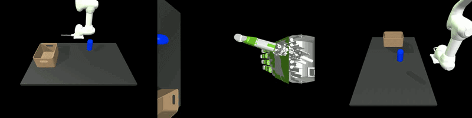

<div align="center">

# Aidin-Doosan Dexterous Manipulation

Public thesis progress on dexterous manipulation with a Doosan arm and Aidin hand.

</div>

<p align="center">
  
</p>

<p align="center">
  <em>ACT inference rollout trained from mostly open-loop scripted demonstrations with tactile feedback.</em>
</p>

## Current Snapshot

- Best saved one-object simulation result: 100% success across train, wide-XY, and very-wide-XY evaluations.
- Strong vision/qpos baseline: 88% success on the train pose distribution and 78% on wider pose tests.
- Tactile-summary observations coincide with the best saved result, but ablations with mean/zero/noise tactile are also strong. This means tactile is not yet proven to be the causal reason for success.
- Current takeaway: tactile should become more useful with contact-rich recovery demonstrations, wider object/physics randomization, and policies that must react to slip or poor contact.

Loss curves exist for the saved runs, but exact best validation-loss values are not yet logged in a clean public format.

## Overview

This repository shares selected public progress from my thesis work on robot manipulation with a dexterous hand. The private development repository contains the code, datasets, experiment scripts, and implementation notes.

## Research Question

Can an ACT-style imitation policy for dexterous manipulation become more robust when tactile sensing is treated as a contact signal rather than just another observation vector?

This project explores tactile-aware action chunking for an arm-hand system: learning from demonstrations, measuring when tactile information matters, and testing whether contact history helps under pose, friction, mass, or grasp-quality shifts.

## Method Direction

- Goal-conditioned ACT, where the policy receives compact object, target, or task-phase information in addition to images and robot state.
- Object-centric policy structure that separates perception, goal proposal, and low-level action generation.
- Tactile summaries and tactile-history features that encode contact onset, force changes, active taxels, and possible slip over time.
- Richer teleoperation demonstrations using hand and wrist tracking, especially trajectories that include contact recovery instead of only nominal open-loop motion.
- Simulation-to-robot evaluation with controlled shifts in pose, object geometry, friction, and mass.

## Media

Photos, rollout videos, and learning curves will be added here as the project develops.

```text
assets/
├── figures
├── images
└── videos
    └── video_real_pose_wide_xy.gif
```

## Notes

This repository does not include source code, private notes, raw datasets, checkpoints, or calibration files.
